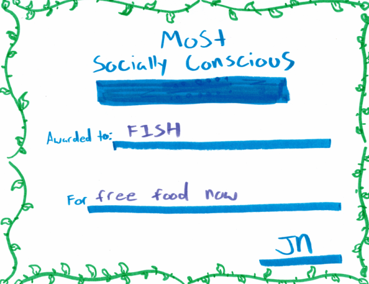

# SummerFoodRocks node application

## Table of contents

* [General info](#general-info)
* [Technologies](#technologies)
* [Awards](#awards)

## General info

The project was built using Bootstrap CSS, javascript, jQuery, and firebase. It utilizes an API provided by the Food and Nutrition Services of the USDA for the meal site data.

The Summer Food Service Program (SFSP) ensures that low-income children continue to receive nutritious meals when school is not in session. Each summer, the SFSP program serves more than 200 million free meals to children 18 years and under at approved sites.

This site finder is a web-based application that also works on tablets, smartphones and other mobile devices without the need for a download. It will geolocate the users position and return listings of nearby meal sites.

The mapping tool also allows users to enter an address, city, state or zip code to find nearby locations, along with their addresses, days and hours of operation, contact information, and directions.

Data, provided by states, is updated throughout each summer to include new locations. To report incorrect data, please contact your state agency.

## Technologies

Project is created with:

* DigitalOcean VPS Server, Ubuntu 18.04
* Node.js
* MySql, PM2, Git,

## Awards

Awarded the "Most Socially Conscious" for initial pilot phase of this project during the 2018 Cohort of the Denver University: FullStack Coding Bootcamp.

